# Preamble 
R is a powerful statistical programming language that is built to work well with large and diverse datasets.   
This notes aims at giving readers a routemap to get started with programming language R and its IDE (Integrated Development Environment) RStudio. We are going to look at how to download, install and understand the basic components of R and RStudio.
 
 
## Downloading And installing R
R software can be downloaded from website  https://cran.r-project.org/
   
The website looks like this. 

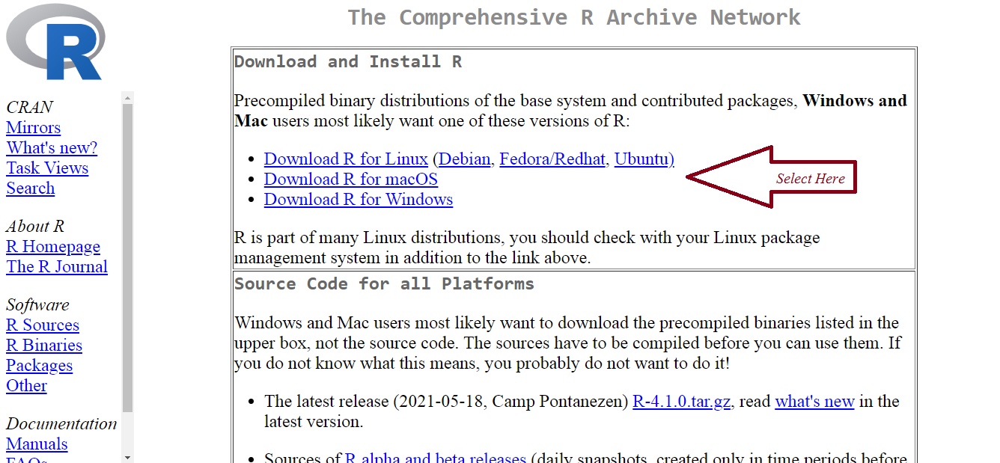

 
   
From this we can  choose the option whether we wish to download for Windows or Mac or Linux OS

*The following page is for Windows*

 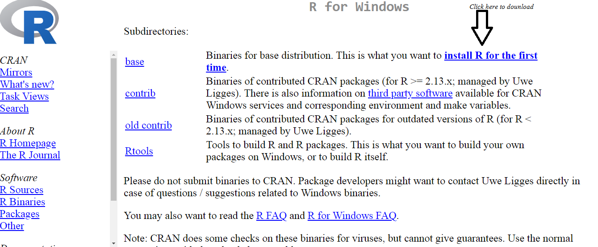
   
   
*The following page is for Mac* 

 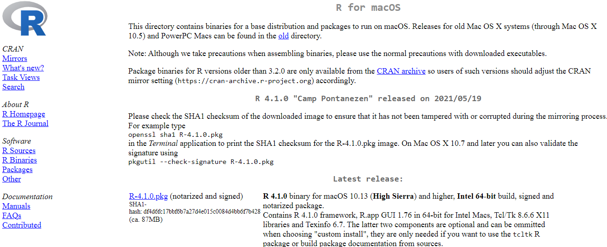
    
        
*The following page is for Linux*  

 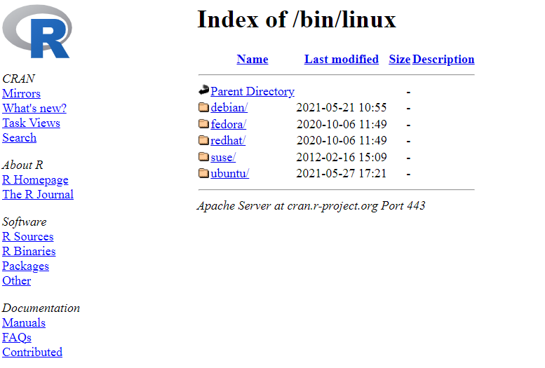
    
    
Once downloaded R can be installed by clicking the file which is downloaded and by following the instructions. After installing the Software we can see the welcome page as shown below

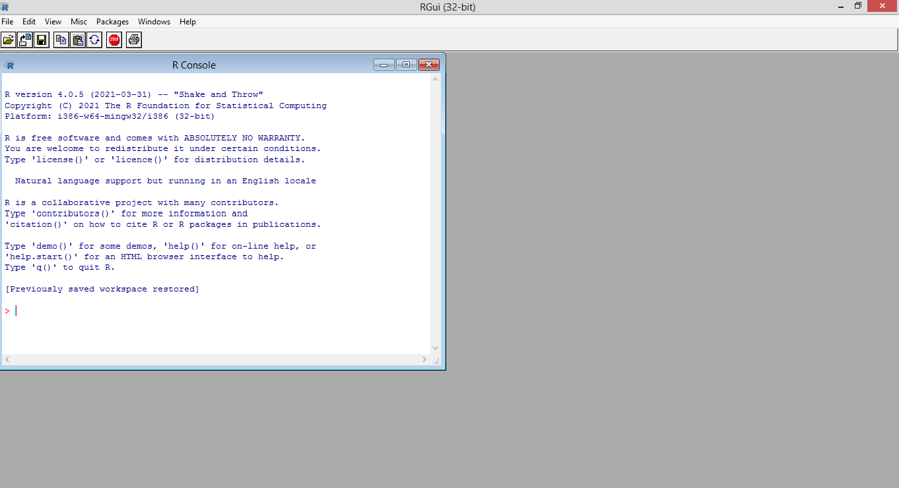
    
Since we have done installing R we can move forward with RStudio

## Downloading and installing RStudio

RStudio web page URL is https://www.rstudio.com/products/rstudio/ 

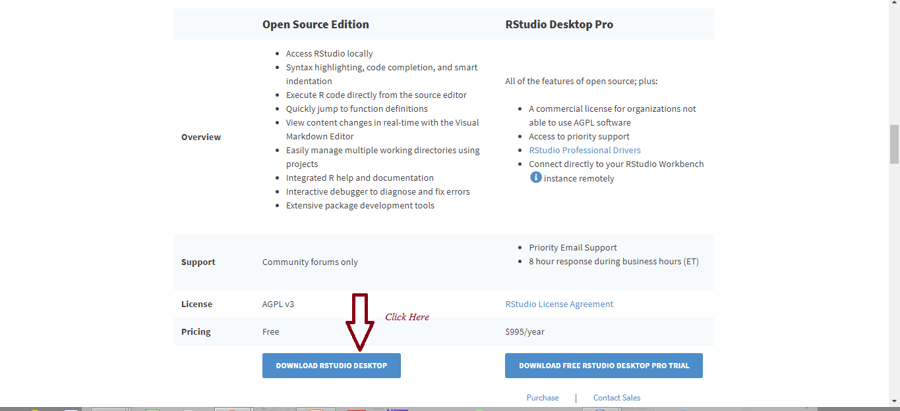

**Version available**

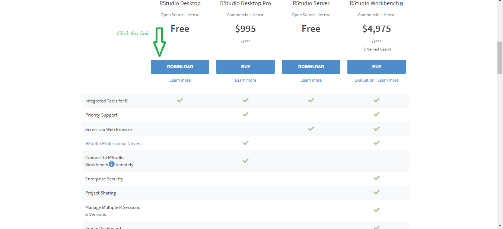  

**based on OS choose the file to download**

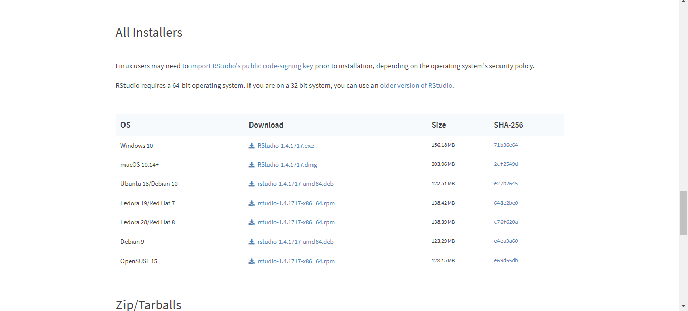

**Installing**

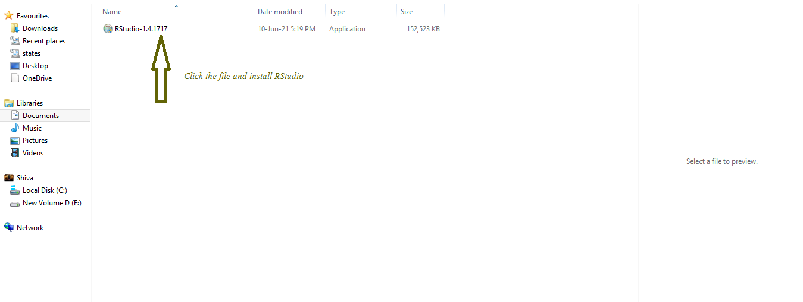

### Components of RStudio   
RStudio is divided into 4 Panes

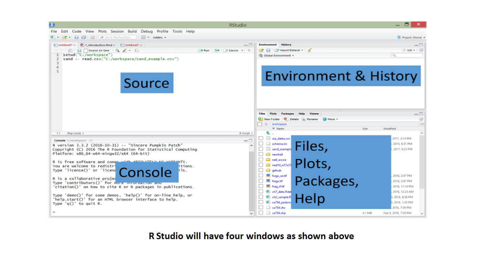

Description of these components

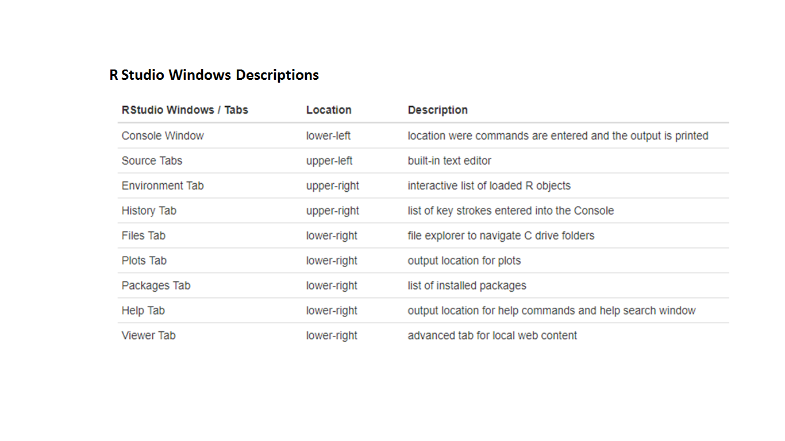

### Menu bar
Menu bar consists of various actions which can be performed, Let us see some of most used options
   
   1)File
   used to create various Documents such as R Script, R Markdown, R Shiny etc
   
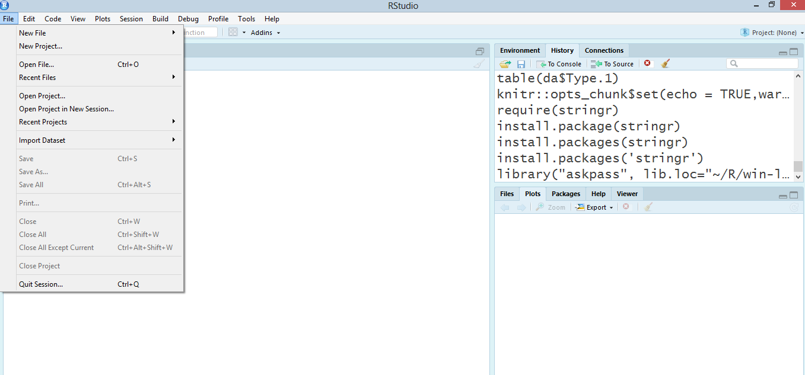
   
   2)Edit
   Consists of various editing options

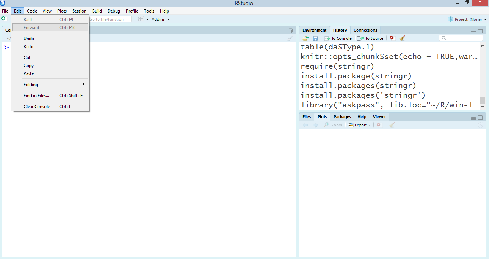

   3)View
   Used to customise look and feel

  
   
   4)Tools    
   Tools provide various useful options of tasks which can be performed.   

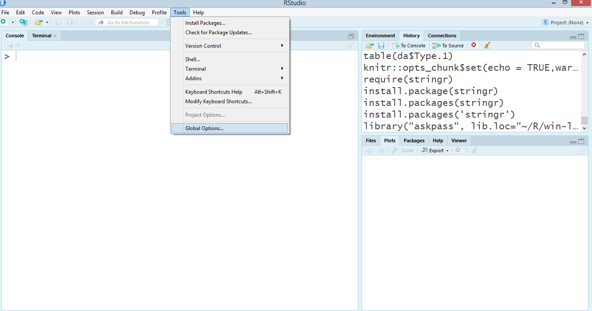  
   
   Global options is an important tool which we will be interested in, we can change theme, default settings like saving workspace image(history of commands performed ) etc can be changed 
   

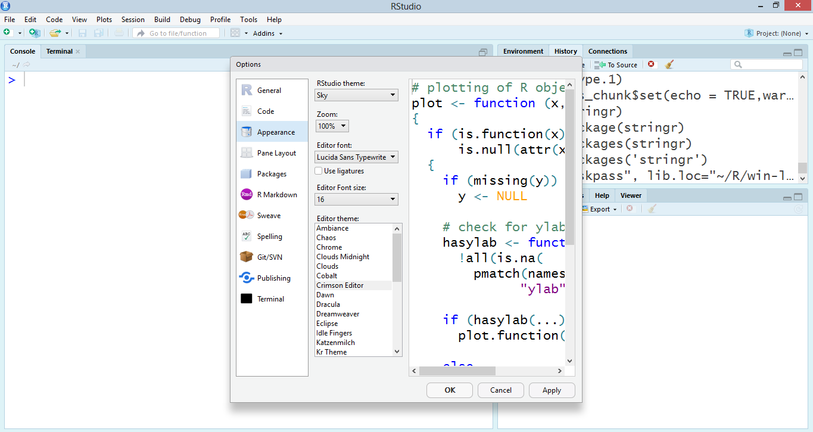 

### Console Pane (Bottom Left)
Console is the place where R codes are executed 

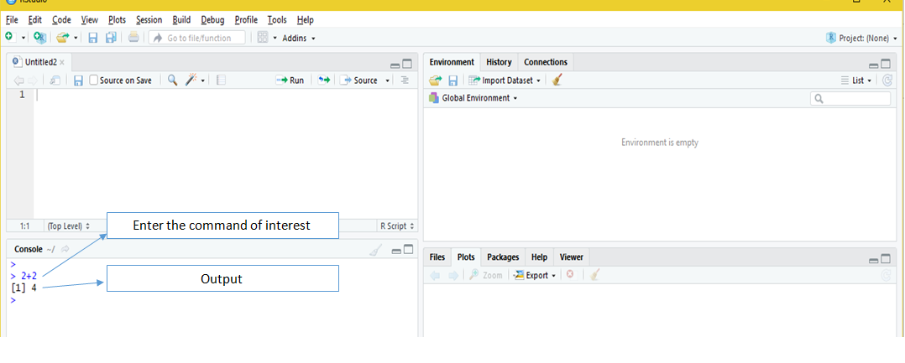

### Environment and History (Top Right)

The values and data we load in R is stored in Environment

 
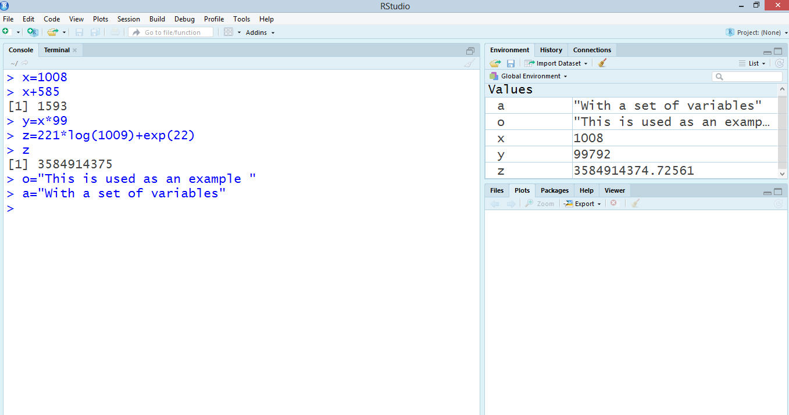

We can see previously executed commands using history section
 
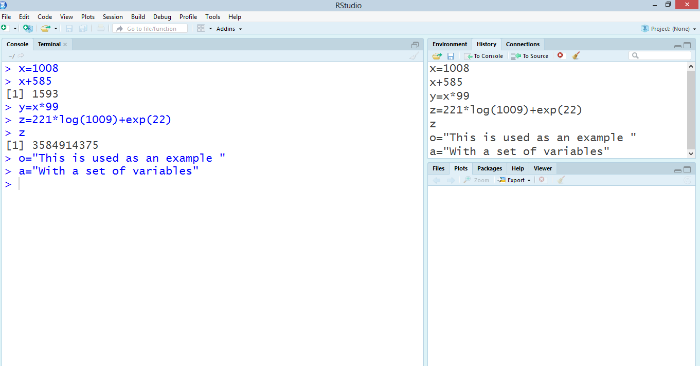
**Importing dataset**

 
.png)
**Importing an Excel file**

.png)

### Help and Packages (Bottom Right) 

**Help** Section is used to know more about function, dataset, package

.png)

**Package** section aids us in accessing packages in R (To know more about packages please refer http://rpubs.com/Thinklabz/Intro_to_R_packages )

.png)

To install a package using RStudio we can search the package's name here

.png)

.png)
 
.png)
 
.png)
**Loading package**

.png)

### Source (Top Left)
Source is the place where we have various files which we can work with R. We can edit source files and run it either line by line or full document also.  
**Using R Script for writing code**

.png)

# Final Note
This notes has given an introduction to R and RStudio. Feel free to reach out for queries.

